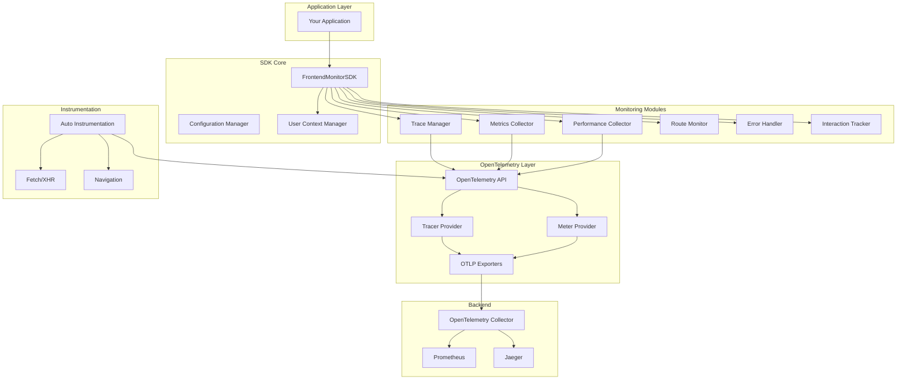
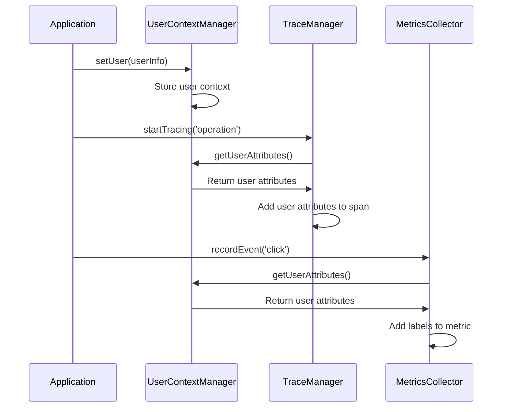
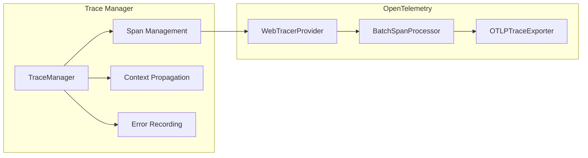
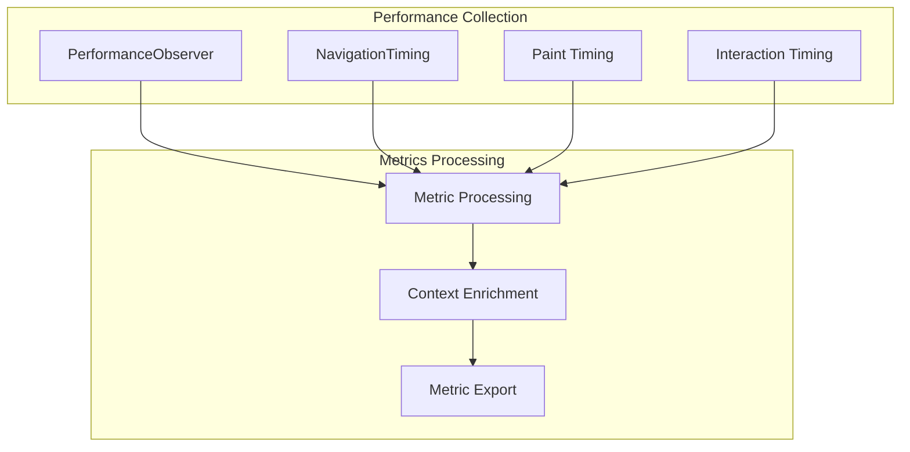
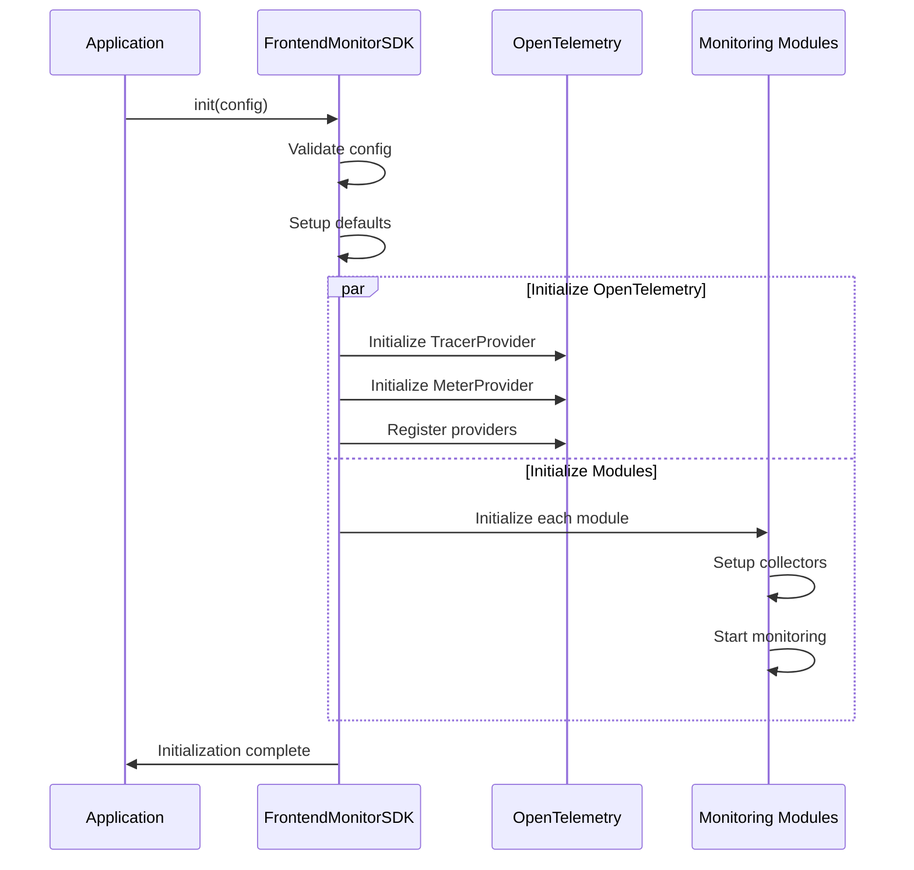
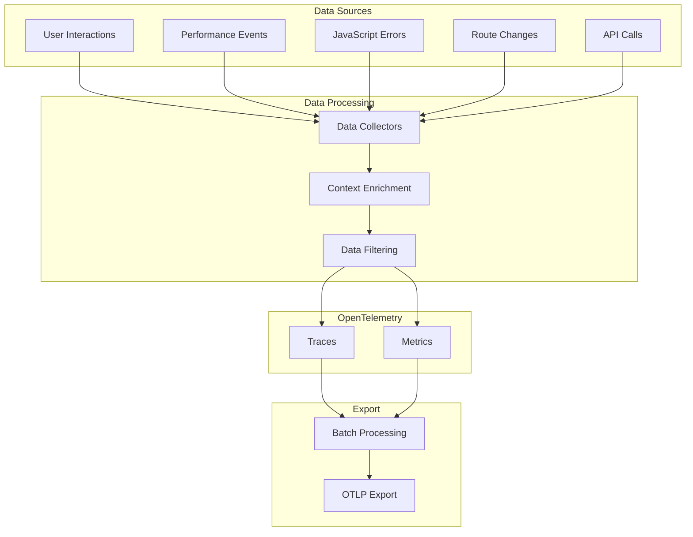
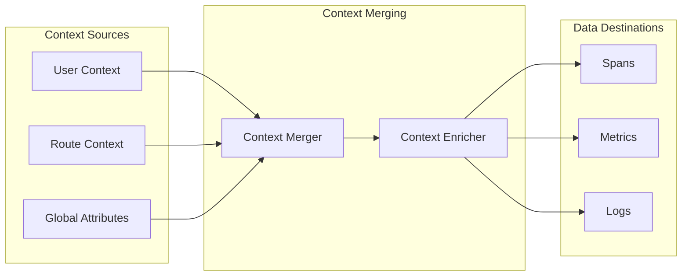

# Frontend Monitor SDK Architecture

## Overview

The Frontend Monitor SDK is built on top of OpenTelemetry standards to provide comprehensive observability for web applications. The architecture follows a modular design that separates concerns while maintaining high performance and flexibility.

## Core Architecture



## Module Architecture

### 1. Core SDK (`FrontendMonitorSDKImpl`)

The main orchestrator that coordinates all monitoring modules.

**Responsibilities**:
- SDK initialization and lifecycle management
- Module coordination and configuration
- User context management
- Resource cleanup and shutdown

**Key Features**:
- Singleton pattern enforcement
- Lazy initialization of modules
- Graceful error handling and fallbacks

### 2. Configuration System

Hierarchical configuration with sensible defaults:

```typescript
// Default Configuration
const DEFAULT_CONFIG = {
  sampleRate: 1.0,
  exportIntervalMillis: 30000,
  enablePerformanceMonitoring: true,
  enableErrorMonitoring: true,
  enableUserInteractionMonitoring: true,
  enableAutoTracing: true,
  enablePerformanceMetrics: true,
  enableCustomMetrics: true
};

// User Configuration
const userConfig = {
  serviceName: 'my-app',
  endpoint: 'https://otel.example.com',
  // ... overrides
};

// Merged Configuration
const finalConfig = { ...DEFAULT_CONFIG, ...userConfig };
```

### 3. User Context Management (`UserContextManager`)

Manages user identity and attributes across all monitoring data.

**Features**:
- Centralized user context storage
- Automatic attribute propagation
- Privacy-conscious data handling
- Context clearing on logout

**Data Flow**:


### 4. Tracing Module (`TraceManager`)

Provides distributed tracing capabilities built on OpenTelemetry.

**Architecture**:


**Key Features**:
- Automatic span lifecycle management
- Context propagation across async operations
- Built-in error recording
- Performance-optimized span creation

### 5. Metrics Collection

Dual metrics collection system for comprehensive observability.

#### 5.1 Performance Metrics (`PerformanceCollector`)

Collects Web Vitals and navigation timing data:

```typescript
interface PerformanceMetrics {
  fcp?: number;      // First Contentful Paint
  lcp?: number;      // Largest Contentful Paint
  fid?: number;      // First Input Delay
  cls?: number;      // Cumulative Layout Shift
  ttfb?: number;     // Time to First Byte
  domContentLoaded?: number;
  loadComplete?: number;
}
```

**Collection Strategy**:


#### 5.2 Custom Metrics (`CustomMetricsCollector`)

Provides flexible custom metric collection:

**Metric Types**:
- **Counters**: Monotonically increasing values (e.g., request counts)
- **Histograms**: Value distributions (e.g., response times)
- **Gauges**: Current values (e.g., active connections)

**Implementation**:
```typescript
class CustomMetricsCollector {
  private counters = new Map<string, Counter>();
  private histograms = new Map<string, Histogram>();
  private gauges = new Map<string, ObservableGauge>();

  // Efficient metric reuse
  getCounter(name: string, options?: CustomMetricOptions): Counter {
    if (!this.counters.has(name)) {
      this.counters.set(name, this.meter.createCounter(name, options));
    }
    return this.counters.get(name)!;
  }
}
```

### 6. Route Monitoring (`RouteMonitor`)

Advanced route change tracking for SPAs and traditional applications.

**Supported Routing**:
- Hash-based routing (`#/path`)
- History API (`pushState`, `replaceState`)
- Browser navigation (`popstate`)
- Page loads (`load`)

**Route Parsing**:
```typescript
interface RouteInfo {
  path: string;           // /users/123/profile?tab=settings
  params: Record<string, string>;  // { id: '123' }
  query: Record<string, string>;   // { tab: 'settings' }
}

class RouteParser {
  parse(url: string, pattern?: string): RouteInfo {
    // Custom route pattern matching
    // Parameter extraction
    // Query string parsing
  }
}
```

### 7. Error Handling System

Comprehensive error capture and reporting:

**Error Sources**:
- Global JavaScript errors (`window.onerror`)
- Unhandled Promise rejections (`unhandledrejection`)
- Resource loading errors
- Custom error reporting

**Error Enrichment**:
```typescript
interface ErrorContext {
  error: Error;
  context?: {
    user_attributes: Record<string, string>;
    route_info: RouteInfo;
    browser_info: BrowserInfo;
    custom_attributes: Record<string, any>;
  };
  level: 'error' | 'warning' | 'info';
}
```

## Data Flow Architecture

### 1. Initialization Flow



### 2. Data Collection Flow



### 3. Context Propagation



## Performance Architecture

### 1. Resource Management

**Memory Efficiency**:
- Lazy loading of monitoring modules
- Efficient metric reuse with caching
- Automatic cleanup of unused resources
- Bounded queues for data processing

**CPU Optimization**:
- Asynchronous data processing
- Batch operations for metric export
- Debounced event handling for high-frequency events
- Web Workers for heavy computations (future)

### 2. Sampling Strategy

Hierarchical sampling to control data volume:

```typescript
interface SamplingConfig {
  traceSampleRate: number;        // 0.0 - 1.0
  errorSampleRate: number;        // 0.0 - 1.0
  interactionSampleRate: number;  // 0.0 - 1.0
  performanceSampleRate: number;  // 0.0 - 1.0
}

// Adaptive sampling based on user count
const adaptiveSampling = {
  highTraffic: { traceSampleRate: 0.01 },   // 1% sampling
  mediumTraffic: { traceSampleRate: 0.1 },  // 10% sampling
  lowTraffic: { traceSampleRate: 1.0 }      // 100% sampling
};
```

### 3. Batch Processing

Efficient data export through batching:

```typescript
interface BatchConfig {
  maxQueueSize: number;           // Maximum items in queue
  maxExportBatchSize: number;     // Items per batch
  scheduledDelayMillis: number;   // Export interval
  exportTimeoutMillis: number;    // Export timeout
}

// Default optimized batching
const defaultBatchConfig = {
  maxQueueSize: 100,
  maxExportBatchSize: 10,
  scheduledDelayMillis: 5000,    // 5 seconds
  exportTimeoutMillis: 30000     // 30 seconds
};
```

## Security Architecture

### 1. Data Privacy

**PII Protection**:
- Automatic PII detection and filtering
- Configurable sensitive data patterns
- User consent management
- Data anonymization options

**Configuration Example**:
```typescript
const privacyConfig = {
  sensitiveFields: ['password', 'ssn', 'credit_card'],
  anonymizeIPs: true,
  excludeUserAgents: false,
  consentRequired: false
};
```

### 2. Secure Data Transmission

**Transport Security**:
- HTTPS-only endpoints
- Certificate validation
- Request signing (optional)
- Retry with exponential backoff

**Data Integrity**:
- Data validation before export
- Checksums for large payloads
- Corruption detection and recovery

## Integration Architecture

### 1. Framework Adapters

**Framework-Specific Integration Points**:
```typescript
interface FrameworkAdapter {
  init(): Promise<void>;
  trackRouteChange(from: string, to: string): void;
  trackUserInteraction(event: UserInteractionEvent): void;
  handleComponentError(error: Error, component: string): void;
  destroy(): void;
}

// React Adapter
class ReactAdapter implements FrameworkAdapter {
  // React-specific implementations
}

// Vue Adapter
class VueAdapter implements FrameworkAdapter {
  // Vue-specific implementations
}
```

### 2. Plugin System

**Plugin Architecture**:
```typescript
interface Plugin {
  name: string;
  version: string;
  init(sdk: FrontendMonitorSDK): void;
  destroy(): void;
}

// Example Analytics Plugin
class AnalyticsPlugin implements Plugin {
  name = 'analytics';
  version = '1.0.0';

  init(sdk: FrontendMonitorSDK) {
    // Custom analytics integration
  }

  destroy() {
    // Cleanup
  }
}
```

## Testing Architecture

### 1. Unit Testing Strategy

**Test Structure**:
```typescript
describe('TraceManager', () => {
  let traceManager: TraceManager;
  let mockTracer: jest.Mocked<Tracer>;

  beforeEach(() => {
    // Setup mocks and test environment
  });

  describe('startSpan', () => {
    it('should create span with correct attributes', () => {
      // Test implementation
    });

    it('should propagate user context', () => {
      // Test context propagation
    });
  });
});
```

### 2. Integration Testing

**End-to-End Test Scenarios**:
- SDK initialization with various configurations
- Data flow from collection to export
- Error handling and recovery
- Performance under load

### 3. Browser Compatibility Testing

**Supported Browsers**:
- Chrome 90+
- Firefox 88+
- Safari 14+
- Edge 90+

## Build and Distribution Architecture

### 1. Build System

**Rollup Configuration**:
```javascript
// ES Modules (modern bundlers)
{
  input: 'src/index.ts',
  output: {
    file: 'dist/index.esm.js',
    format: 'esm',
    sourcemap: true
  }
}

// CommonJS (Node.js bundlers)
{
  input: 'src/index.ts',
  output: {
    file: 'dist/index.js',
    format: 'cjs',
    exports: 'named'
  }
}

// UMD (browsers without bundlers)
{
  input: 'src/index.ts',
  output: {
    file: 'dist/index.umd.js',
    format: 'umd',
    name: 'FrontendMonitorSDK'
  }
}
```

### 2. TypeScript Configuration

**Type System Design**:
```typescript
// Strict typing with comprehensive interfaces
export interface FrontendMonitorSDK {
  // Public API methods
}

// Internal types hidden from consumers
interface InternalSDK extends FrontendMonitorSDK {
  // Private implementation details
}
```

### 3. Package Distribution

**Package.json Configuration**:
```json
{
  "main": "dist/index.js",
  "module": "dist/index.esm.js",
  "types": "dist/index.d.ts",
  "exports": {
    ".": {
      "import": "./dist/index.esm.js",
      "require": "./dist/index.js",
      "types": "./dist/index.d.ts"
    }
  },
  "files": ["dist", "README.md"]
}
```

## Monitoring and Observability

### 1. SDK Self-Monitoring

The SDK monitors its own performance and health:

```typescript
interface SDKHealth {
  initializationStatus: 'pending' | 'success' | 'failed';
  lastExportTime: number;
  exportQueueSize: number;
  errorCount: number;
  memoryUsage: number;
}
```

### 2. Performance Metrics

**Internal Metrics**:
- Export latency and success rates
- Collection queue sizes
- Memory usage trends
- Error rates by category

### 3. Debug Support

**Debug Modes**:
```typescript
// Development debugging
localStorage.setItem('debug', 'frontend-monitor:*');

// Performance profiling
localStorage.setItem('profile', 'true');

// Verbose logging
localStorage.setItem('verbose', 'true');
```

## Future Architecture Enhancements

### 1. Planned Features

**Real-time Monitoring**:
- WebSocket connections for real-time data streaming
- Live dashboard integration
- Alerting and anomaly detection

**Advanced Analytics**:
- Machine learning-based anomaly detection
- User behavior pattern analysis
- Performance bottleneck identification

### 2. Scalability Improvements

**Distributed Processing**:
- Edge computing integration
- Client-side data aggregation
- Intelligent sampling strategies

**Performance Optimization**:
- Web Workers for heavy computations
- SIMD optimizations for data processing
- Memory-mapped files for large datasets

### 3. Extensibility

**Custom Plugins**:
- Plugin marketplace
- Custom data processors
- Third-party integrations

**Advanced Configuration**:
- Dynamic configuration updates
- Feature flag integration
- A/B testing support

---

This architecture document provides a comprehensive overview of the Frontend Monitor SDK's design principles, implementation details, and future roadmap. The modular design ensures flexibility, maintainability, and extensibility while maintaining high performance and security standards.